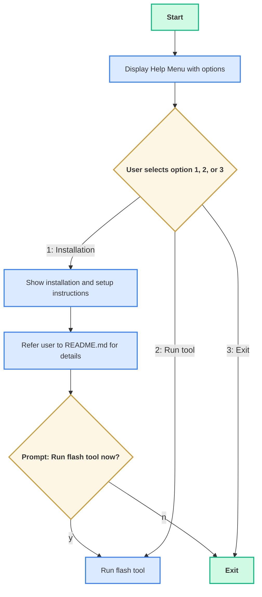
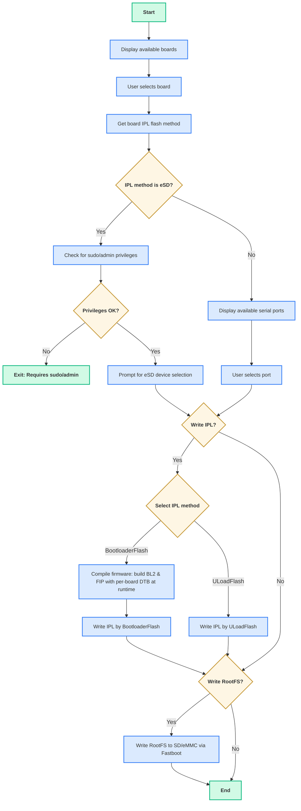
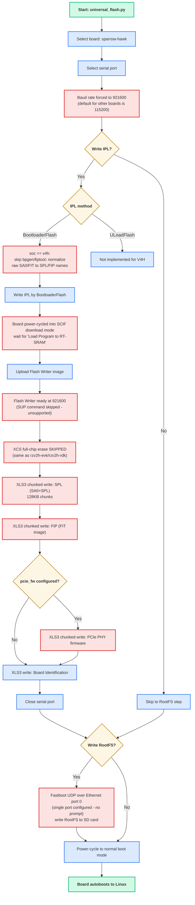

# universal-scripts

The **universal flash script** supports flashing RZ images across multiple boards by using information from a JSON configuration file.

This script offers cross-platform support (for both Windows and Linux operating systems) and handles three key flashing operations for embedded devices:

- Flashing the bootloader
- Flashing the uload-bootloader (only supports xSPI flashing)
- Flashing the Root Filesystem (rootfs) to an SD card / eMMC

Supported boards:

- [RZG2L-SBC](https://www.renesas.com/en/design-resources/boards-kits/rz-g2l-sbc?srsltid=AfmBOopW7k6H7kvdtnxYYs72c6Pm_8u667-UDBi8v9-WXPHjQvzWlhLN)
- [RZG2L-EVK](https://www.renesas.com/en/design-resources/boards-kits/rz-g2l-evkit?srsltid=AfmBOoqqLvuA9ZrzAhhRLi9JR1JVUcoc9MUICwtZ78ZER-hchmQ3ps5I)
- [RS-G2L100](https://www.renesas.com/en/products/microcontrollers-microprocessors/rz-mpus/rz-partner-solutions/geniatech-g2l100)
- [RZV2L-EVK](https://www.renesas.com/en/design-resources/boards-kits/rz-v2l-evkit?srsltid=AfmBOooz3AGWNCJNed1qk6NS0qeZBngU79XQ4h2KUkmMam82y615JPjr)
- [RZV2H-EVK](https://www.renesas.com/en/design-resources/boards-kits/rz-v2h-evk?srsltid=AfmBOooL-eoj5j3zum-HIL5v0JE9SROaKosWHYCOHfvySpJ4g39N9R_V)
- [RZV2H-RDK](https://www.renesas.com/en/design-resources/boards-kits/ws125-v2hrdkrefz)
- [IMDT V2H-SBC](https://www.renesas.com/en/products/microcontrollers-microprocessors/rz-mpus/rz-partner-solutions/imdt-v2-sbc)
- Sparrow-Hawk (RZ/V4H, R8A779G3) — see [RZ/V4H (Sparrow-Hawk) flashing flow](#rzv4h-sparrow-hawk-flashing-flow) for how it differs from the boards above

## Prerequisites:

Before running the scripts, ensure the following dependencies are installed.

### Python

- **Windows**: Download and install Python from the [official website](https://www.python.org/downloads/). Make sure Python is installed with the "Add Python to environment variables" and "Install pip" options enabled.

- **Linux**:  
  ```sh
  sudo apt install python3
  ```

#### Required Python packages

The flashing script depends on the following Python packages. Install them if missing:

- **pyserial**
- **dataclasses** (only if using Python < 3.7)

1. On Linux:

If Python 3.12 is in use: set up a virtual environment first.

```shell
renesas@builder-pc:~/rz-cmn-srp-3.0/host/tools#  sudo apt update
renesas@builder-pc:~/rz-cmn-srp-3.0/host/tools#  sudo apt install python3.12-venv
renesas@builder-pc:~/rz-cmn-srp-3.0/host/tools#  python3 -m venv .venv
renesas@builder-pc:~/rz-cmn-srp-3.0/host/tools#  source .venv/bin/activate
```

After the virtual environment is active, choose one of the two install methods:

- Option 1 - Use `requirements.txt` (recommended)
  ```sh
  cd <path/to/your/package/host/tools>
  pip3 install -r requirements.txt
  ```

- Option 2 - Install manually

```sh
# Ensure pip is available
sudo apt install python3-pip

# Install required packages
pip3 install pyserial
pip3 install dataclasses
```

2. On windows, there are two ways to install:

- If `pip` is missing, repair your Python installation or download [get-pip.py](https://bootstrap.pypa.io/get-pip.py) and run:
    ```powershell
    py get-pip.py
    ```
- Install required packages:
  1. Option 1 - Use `requirements.txt` (recommended)
    ```powershell
    cd <path/to/your/package/host/tools>
    py -m pip install -r requirements.txt
    ```
  2. Option 2 - Install manually
  - Using the Python launcher:

  ```powershell
  py -m pip install pyserial
  py -m pip install tomli
  py -m pip install dataclasses       # Only if Python < 3.7
  ```
 - Or using `pip` directly (if already in PATH):

 ```powershell
  pip install pyserial
  pip install tomli
  pip install dataclasses   # only if Python < 3.7
 ```

### Environment and Tool Dependencies

Make sure you have the following installed or available in `tools/bin/<os>` or `host/tools/bin/<os>`:
- `bpgen` - unified boot parameter generator (already included in the release package)
- `fiptool` - TF-A utility (already included in the release package)
- `objcopy` - part of GNU binutils (see installation steps above)
- `dd` - used to write bootloader binaries directly to the raw SD card device during eSD flashing

Firmware binaries and DTBs must be available in the following location (already included in the release package):

```
target/images/
```

#### Linux

Install the required toolchain and fastboot:

```sh
sudo apt-get update
sudo apt-get install build-essential android-tools-fastboot -y
```

#### Windows

**USB OTG Flashing on Windows**

Fastboot/OTG flashing on Windows requires the device's **Fastboot / USB-download** interface to use the **WinUSB** driver.

> **Note:** Windows binds drivers to the **device/interface present at install time** (VID/PID[/MI]). This Fastboot interface exists **only while** the board is connected over OTG **and** go to OTG download mode.

**Steps to verify USB OTG dependencies are installed correctly:**

1. **Prepare connections**
   - Connect the board's USB-to-serial to the PC and open a terminal (115200 8-N-1).
   - Open **Tera Term** (or any serial console) on the correct COM port/baud.

2. **Enter U-Boot and switch to USB OTG Fastboot**
   - **Power on** the board and **interrupt autoboot** to get a `U-Boot>` prompt.
   - Connect the board's **USB OTG** port to the PC.
   - At the U-Boot prompt, run:
     ```bash
     setenv serial# 'Renesas1'
     fastboot usb 27
     ```
     > This places the board into **USB OTG fastboot/download** mode.\
     > `27` is the index used on RZ Common System

3. **Bind WinUSB using Zadig**
   - Download the latest **[Zadig](https://zadig.akeo.ie/)** and run it (no installation needed).
   - In Zadig, go to **Options → List All Devices**.
   - From the dropdown, select the device that represents the bootloader/fastboot interface.
     - **USB Download Gadget**
   - On the right, set **Driver** to **WinUSB**.
   - Click **Install Driver** (or **Replace Driver**).

4. **Verify**
   - Open **PowerShell** or **Command Prompt** and run:
     ```powershell
     .\path\to\package\sd_creator\tools\fastboot.exe devices
     ```

     Expected:
     ```
      Renesas1         fastboot
     ```

> [!NOTE]  
> **All dependencies bundled for Windows - No Installation Required**  
> All required tools and runtime libraries are pre-bundled in `tools/bin/windows/`:
> - `fiptool.exe` + `libcrypto-3-x64.dll` (OpenSSL library)
> - `bpgen.exe` (statically linked, no DLLs needed)
> - `objcopy.exe` + `libwinpthread-1.dll` (MinGW runtime)
>
> **You do NOT need to install MinGW-w64, MSYS2, or OpenSSL.** The scripts automatically use the bundled binaries.

## JSON Configuration for a New Board

The `flash_images.json` file contains predefined image mappings for supported devices.

`flash_images.json` supports several default boards. You can add a custom board to the configuration file by providing the following information:

- **SoC**: Soc type
- **bl2**: BL2 image name (V2L/V2H/G2L boards)
- **spl** *(V4H only)*: SPL image name — the SA0 header + SPL binary (`sa0.bin`). Used **instead of** `bl2` for boards whose `soc` is `v4h`; see [RZ/V4H (Sparrow-Hawk) flashing flow](#rzv4h-sparrow-hawk-flashing-flow).
- **pcie_fw** *(V4H only, optional)*: PCIe PHY firmware image name (`rcar_gen4_pcie.bin`). If set, it is flashed as an extra image after SPL/FIP.
- **board_identification**: Board identification image name
- **fip**: FIP image name. For `soc: v4h` boards this is a FIT image (`u-boot.itb`) rather than the TF-A FIP package used by other boards.
- **tee** *(legacy boards only, optional)*: OP-TEE BL32 binary name. If it
  exists under `target/images/atf/`, `fiptool --tos-fw` includes it in the
  legacy BL2/FIP boot chain. It is not a valid `sparrow-hawk` field: V4H
  payloads are installed by Yocto in rootfs p2 `/boot`, never at a SPI-NOR
  TEE offset. rz-utils treats that WIC payload as opaque.
- **atf_fdts**: FCONF device tree name
- **uboot_dtb**: U-boot device tree name
- **flash_writer**: Flash Writer image name
- **ipl_flash_method**: Method used by the IPL bootloader for flashing (`xspi` or `emmc`)
- **rootfs**: Root filesystem image name (`*.wic`)
- **rootfs_flash_method**: Method to flash the SD card (`udp` or `otg`)

This table below lists the available options (and sensible defaults) for `ipl_flash_method` and `rootfs_flash_method` per board.

| Board           | SoC/MPU | ipl_flash_method      | Default | rootfs_flash_method | Default |
|-----------------|---------|-----------------------|---------|---------------------|---------|
| rzg2l-sbc       | g2l     | xspi                  | xspi    | udp                 | udp     |
| rs-g2l100       | g2l     | xspi                  | xspi    | udp, otg            | otg     |
| rzg2l-evk       | g2l     | xspi, emmc, esd       | xspi    | udp, otg            | otg     |
| rzv2l-evk       | v2l     | xspi, emmc, esd       | xspi    | udp, otg            | otg     |
| rzv2h-evk       | v2h     | xspi, esd             | xspi    | udp, otg            | otg     |
| rzv2h-rdk       | v2h     | xspi, esd             | xspi    | udp                 | udp     |
| imdt-v2h-sbc    | v2h     | xspi                  | xspi    | udp, otg            | otg     |
| sparrow-hawk    | v4h     | xspi                  | xspi    | udp                 | udp     |

**Notes:**
- *IPL flash method*: `emmc` for `rzv2h` devices is **not supported yet**.
- *RZ/G2L-SBC*: `otg` flashing is not supported. This board supports UDP flashing only.
- *Sparrow-Hawk (RZ/V4H)* uses a different set of images and a different serial protocol than the boards above — see [RZ/V4H (Sparrow-Hawk) flashing flow](#rzv4h-sparrow-hawk-flashing-flow). The `xspi` serial protocol has historical hardware evidence. Direct OP-TEE boot and runtime validation are owned by the U-Boot/Yocto release, not by rz-utils. `boards_flash_config.toml` also has `[sparrow-hawk.emmc]`/`[sparrow-hawk.esd]` tables and the code paths are generically wired for V4H (via the `SPL` key), but **`emmc` is not currently usable**: `__handle_emmc_flash()` unconditionally sends the `SUP` command to switch to 921600 baud, which Sparrow-Hawk's Flash Writer does not support (it boots at 921600 already and replies `command not found`), so this path will hang/fail. `esd` is implemented but has not been validated on hardware for this board.
- *Sparrow-Hawk (RZ/V4H)*: `otg` rootfs flashing is not supported on this board. This board supports UDP flashing only, over Ethernet port 0.

---

## Field Reference

- **`tee`** *(legacy `g2l`/`v2l`/`v2h` only, optional)*
  If set and the binary exists under `target/images/atf/`,
  `firmware_compile.py` passes it to `fiptool --tos-fw` when building the
  legacy FIP. V4H configuration must not define this field: rz-utils no
  longer offers `--image_tee` or a V4H SPI-NOR TEE offset.
- **`ipl_flash_method`**
  Defines where the **IPL/BL2** image is flashed:
  - `xspi` — xSPI flash for RZ/V2H, QSPI for RZV2L/RZG2L
  - `emmc` — eMMC device
  - `esd` — eSD card
- **`rootfs_flash_method`**
  How the **root filesystem (.wic)** is delivered to the SD/eMMC target:
  - `udp` — U-Boot `fastboot udp` over Ethernet
  - `otg` — U-Boot `fastboot usb` (USB-OTG)

Example of a sample board configuration in JSON:

```json
"rzg2l-sbc": {
    "soc": "g2l",
    "bl2": "bl2_bp_rzg2l-sbc.srec",
    "board_identification": "rzg2l-sbc-platform-settings.bin",
    "fip": "fip_rzg2l-sbc.srec",
    "tee": "tee-rz-cmn-g2l.bin",
    "atf_fdts": "rzg2l-sbc.dtb",
    "uboot_dtb": "rzg2l-sbc.dtb",
    "flash_writer": "Flash_Writer_SCIF_rzg2l-sbc.mot",
    "ipl_flash_method": "xspi",
    "rootfs": "core-image-minimal.wic",
    "rootfs_flash_method": "udp"
}
```

Example of a `v4h` board configuration (Sparrow-Hawk), using `spl`/`pcie_fw` instead of `bl2`:

```json
"sparrow-hawk": {
    "soc": "v4h",
    "spl": "spl_bp_sparrow-hawk.bin",
    "fip": "fip_sparrow-hawk.bin",
    "pcie_fw": "rcar_gen4_pcie.bin",
    "board_identification": "sparrow-hawk-platform-settings.bin",
    "atf_fdts": "r8a779g3-sparrow-hawk.dtb",
    "uboot_dtb": "r8a779g3-sparrow-hawk.dtb",
    "flash_writer": "Flash_Writer_SCIF_sparrow-hawk.mot",
    "ipl_flash_method": "xspi",
    "rootfs": "core-image-weston.wic",
    "rootfs_flash_method": "udp"
}
```

**Note**: When adding a new board entry or adding filename fields for a board, the values for the "bl2" and "fip" fields must include the board identifier (the JSON object key) as a substring.

```
"rzg2l-sbc": {
  "bl2": "bl2_bp_rzg2l-sbc.srec",
  "fip": "fip_rzg2l-sbc.srec",
  ...
}
```

## Flowchart

The universal flash script prompts the user for options and proceeds through the flashing process based on the input. The detailed procedure is as follows:
### Help Menu Flowchart

The following flowchart illustrates the logic when running the help command for the universal flash tool. It shows the user interaction steps and options available:



To display this help menu, use the following command:

- **On Linux:**
  ```bash
  python3 universal_flash.py --help
  ```

- **On Windows:**
  ```powershell
  py universal_flash.py --help
  ```

### Installation Flowchart
This flowchart shows the process when running the universal flash tool directly (without the --help argument). The script will immediately start the flashing workflow:



**Explanation:**
When you run the script without any arguments, it will skip the help menu and immediately prompt you to select a board and begin the flashing process. You will be guided through board selection, serial port setup, IPL and rootfs flashing steps.

Refer to the [Basic Usage](#basic-usage) section for commands to run the tool.

**Notes:**
- Ensure the board is powered off before flashing.
- Insert the SD card if rootfs flashing is selected.
- For Bootloader-flash: set boot switches to SCIF download mode.
- For Uload-flash or rootfs flashing: set boot switches to normal mode.
- **Reset and power-cycle behavior by board:**
  - **RZ/G2L-SBC**
    This board does not provide a dedicated **RESET** button. To restart the board or apply a boot mode change, you must power-cycle it.
  - **RZ/G2L-EVK** and **RZ/V2L-EVK**
    These boards provide a **RESET** button. You can reset the board without removing power, and the USB connection and serial port typically remain available.
  - **RS-G2L100**
    This board does not provide a dedicated **RESET** button. To restart the board or apply a boot mode change, you must power-cycle it.
  - **RZ/V2H-EVK**
    This board provides a **RESET** button. You can reset the board without removing power, and the USB connection and serial port typically remain available.
  - **RZ/V2H-RDK**
    This board does not provide a dedicated **RESET** button. To restart the board or apply a boot mode change, you must power-cycle it by unplugging and reconnecting the power adapter. Because the USB serial interface is powered from the same source, the USB device disconnects during power-cycle and the serial port disappears from the host PC. When power-cycling the board, keep the USB cable connected to the same USB port on the host PC to avoid enumeration or reconnection issues.
  - **IMDT V2H-SBC**
    This board provides a **RESET** button. You can reset the board without removing power, and the USB connection and serial port typically remain available.
  - **Sparrow-Hawk (RZ/V4H)**
    This board provides a **RESET** button. You can reset the board without removing power, and the USB connection and serial port typically remain available. Its Flash Writer talks at 921600 baud from power-on (no `SUP` speed-up step).
- Rootfs flash (UDP Fastboot): U-Boot fastboot-udp uses a single active Ethernet MAC per board. If multiple RJ45/PHY ports exist, only one is active (depending on board support). The script automatically selects the appropriate Ethernet port based on board configuration in `boards_flash_config.toml`. For boards with multiple available ports, the script will prompt you to select which port to use.

  | Board         | Ethernet port(s) used |
  |-------------|----------------------|
  | rzg2l-sbc    | 1                    |
  | rs-g2l100    | 0, 1                 |
  | rzv2l-evk    | 0                    |
  | rzg2l-evk    | 0                    |
  | rzv2h-evk    | 0, 1                 |
  | rzv2h-rdk    | 0                    |
  | imdt-v2h-sbc | 0, 1                 |
  | sparrow-hawk | 0                |

Both fastboot-otg and fastboot-udp write to U-Boot's current MMC device (typically mmc0). Depending on board and revision, mmc0 may point to the SD card or eMMC.

| Board/Rev                                   | Fastboot Method | Typical mmc0 target                                 | How to change target           |
|---------------------------------------------|-----------------|-----------------------------------------------------|-------------------------------|
| RZ/G2L-SBC                                  | UDP             | Carrier SD (board default)                          | N/A (single device)           |
| RS-G2L100                                   | UDP, OTG        | eMMC                                                | N/A (single device)           |
| RZ/V2L-EVK                                  | UDP, OTG        | SD (CN3 on SOM or eMMC device depending on SW1)     | Set SW1-2 ON to SD and OFF to eMMC |
| RZ/G2L-EVK                                  | UDP, OTG        | SD (CN3 on SOM or eMMC device depending on SW1)     | Set SW1-2 ON to SD and OFF to eMMC |
| RZ/V2H-EVK (Rev 1 – 2 SD cards)             | UDP, OTG        | SD card slot 0                                      | N/A (single device)           |
| RZ/V2H-EVK (Rev 2 – SD & eMMC)              | UDP, OTG        | eMMC                                                | N/A (single device)           |
| RZ/V2H-RDK                                  | UDP             | SD card                                             | N/A (single device)           |
| IMDT V2H-SBC                                | UDP, OTG        | eMMC                                                | N/A (single device)           |
| Sparrow-Hawk (RZ/V4H)                       | UDP             | SD card                                             | N/A (single device)           |

---

## RZ/V4H (Sparrow-Hawk) Flashing Flow

Sparrow-Hawk (RZ/V4H, R8A779G3) shares the same `universal_flash.py` entry point and board-selection flow as the boards above, but its **IPL image set and serial protocol are different**. The differences are isolated to the `BootloaderFlash` path — RootFS flashing (Fastboot UDP, over Ethernet port 0) and ULoadFlash are not affected.

Key differences from the legacy RZV2L/RZV2H/RZG2L flow:

1. **Different image set** — no BL2/FIP pair. Instead: **SPL** (SA0 header + SPL binary, `sa0.bin`), **FIP** as a **FIT image** (`u-boot.itb`), and an optional **PCIe PHY firmware** blob (`rcar_gen4_pcie.bin`) that no other board flashes.
2. **Pre-built raw payloads, normalized at flash time** — for other boards, `firmware_compile.py` runs `bpgen`/`fiptool` at flash time to assemble BL2/FIP. V4H does not run either tool: standalone U-Boot (`binman` `renesas-rcar4-sa0` + FIT) produces `u-boot/sa0-rz-cmn.bin` and `u-boot/u-boot-rz-cmn.itb`. Before flashing, `prepare_binaries()` runs `run_all_v4h()` to copy them to the stable `spl_bp_sparrow-hawk.bin` and `fip_sparrow-hawk.bin` names consumed by the XLS3 flasher (and also emits SREC evidence files). The raw inputs must therefore be from the same release as the WIC.
3. **Different serial protocol** — `XLS3` (raw binary, chunked in 128KB blocks) instead of `XLS2` (SREC, single upload). This board's Flash Writer has an unreliable SREC→SPI address mapping for large images, so binary chunked mode is used instead, matching the vendor reference flashing tool's behavior.
4. **Different Flash Writer behavior** — boots directly at 921600 baud (the `SUP` speed-up command is not supported — it returns `command not found`) and has no `XCS` full-chip erase step (same as `rzv2h-evk`/`rzv2h-rdk`).

> [!NOTE]
> The **`xspi`** serial protocol has historical Sparrow-Hawk hardware evidence. Direct OP-TEE boot/runtime validation belongs to the matching U-Boot and Yocto release, after rz-utils has flashed its supplied SPL/FIP and WIC. `[sparrow-hawk.emmc]`/`[sparrow-hawk.esd]` exist in `boards_flash_config.toml` and the bootloader-flash code paths are generically wired for V4H, but **`emmc` is currently broken** for this board: `__handle_emmc_flash()` unconditionally sends `SUP` to switch to 921600 baud, which this board's Flash Writer does not support. `esd` is implemented but not yet validated on Sparrow-Hawk hardware.

> [!NOTE]
> **If Linux hangs at `Waiting for root device /dev/mmcblk1p2...`** after a successful boot to `Starting kernel ...`: the default env's `mmc_args` assumes the rootfs SD card enumerates as `mmcblk1`, but on some hardware it enumerates as `mmcblk0` instead. Fix from the U-Boot prompt: `setenv mmc_args 'setenv bootargs rw rootwait earlycon root=/dev/mmcblk0p2'; saveenv; reset`. This is unrelated to OP-TEE/fitImage — it affects the plain SD-card boot path too.



### Comparison with the legacy RZ flow

| Step | Legacy flow (RZV2L/RZV2H/RZG2L) | Sparrow-Hawk (RZ/V4H) flow |
|---|---|---|
| Firmware build | `bpgen` (BL2+BP) + `fiptool` (FIP) run at flash time | No `bpgen`/`fiptool`; raw SA0/FIT are pre-built elsewhere, then copied to the SPL/FIP flash names |
| Images written | BL2 (`.srec`), FIP (`.srec`), BID | SPL (`.bin`), FIP=FIT (`.bin`), optional PCIe firmware (`.bin`), BID |
| `flash_images.json` key | `bl2` | `spl` (+ optional `pcie_fw`; no V4H `tee` key) |
| `boards_flash_config.toml` key | `[<board>.xspi] BL2 = [...]` | `[sparrow-hawk.xspi] SPL = [...]` |
| Serial protocol | `XLS2` (SREC, one-shot upload) | `XLS3` (raw binary, 128KB chunked) |
| Baud rate | 115200 → `SUP` command switches to 921600 | 921600 from power-on; `SUP` skipped |
| QSPI erase | `XCS` full-chip erase (~60s) before writing | Skipped (same as `rzv2h-evk`/`rzv2h-rdk`) |
| eMMC/eSD config table | `[<board>.emmc]` / `[<board>.esd]`, `BL2` key | `[sparrow-hawk.emmc]` / `[sparrow-hawk.esd]`, `SPL` key |

For the full field-by-field flash offsets, see `bootloader_flasher/README.md` and `config/README.md`.

### Where OP-TEE lives for Sparrow-Hawk

There are two supported OP-TEE models. Do not apply the legacy FIP rule to
Sparrow-Hawk. This is an artifact-ownership boundary, not a rz-utils OP-TEE
execution or test path.

| Flow | Boards / mechanism | Sparrow-Hawk status |
|---|---|---|
| Legacy FIP | `firmware_compile.py` passes `--tos-fw` to `fiptool`; TF-A BL2 loads BL31/BL32 from FIP. | Not applicable: Sparrow-Hawk uses SA0+SPL → U-Boot proper, not TF-A BL2/FIP. |
| Direct raw boot from rootfs p2 `/boot` | U-Boot proper at EL3 loads raw BL31 and OP-TEE, prepares the BL2→BL31 parameters, then `booti`s Linux with a DTB that already contains `/firmware/optee`. | **Required V4H path.** The WIC is the payload carrier; SPI-NOR contains only the loader. |

Sparrow-Hawk's `u-boot.itb` (the `fip_sparrow-hawk.bin` flashed by this tool)
is a binman FIT containing U-Boot proper and FDT. Embedding BL31/OP-TEE in
that SPI image remains invalid: SPL only copies FIT loadables and does not run
the EL3 handoff handlers. In the attempted design, OP-TEE at `0x44100000`
also overwrote the just-loaded U-Boot, leaving the board hung after
`EVTB1 board detected`. Keep the normal SPI layout: `BID=0x2C0000` and
`PCIE=0x300000`. rz-utils has no V4H SPI-NOR TEE write path.

#### Direct raw rootfs flow

The loader in SPI must be a Sparrow-Hawk U-Boot build that contains
`tfa_prepare`. It runs at EL3 and invokes the existing BL31/BL32 handoff code
after validating the fixed load addresses. This is a loader capability, not a
property of a raw file written to SPI-NOR.

The Yocto WIC must contain these files in rootfs p2 (`mmc 0:2`), not in the
small FAT boot partition. rz-utils flashes the WIC as an opaque rootfs image;
it does not load, inspect, update, or validate these files:

| Rootfs file | Load address | Expected size | CRC32 |
|---|---:|---:|---:|
| `/boot/bl31-sparrow-hawk.bin` | `0x46400000` | manifest controlled | manifest controlled |
| `/boot/tee-raw-sparrow-hawk.bin` | `0x44100000` | manifest controlled | manifest controlled |
| `/boot/v4h-direct-optee.env` | scratch import address | manifest fields for U-Boot | n/a |
| `/boot/v4h-direct-optee.manifest` | host-side evidence | SHA-256 and build provenance | n/a |
| `/boot/Image` | `0x50200000` | image dependent | n/a |
| `/boot/dtb/renesas/r8a779g3-sparrow-hawk.dtb` | `0x48000000` | DTB dependent | n/a |

Use the generated `.env` values, not historic hard-coded CRC values or a
`-v5` filename. A direct-capable U-Boot imports the `.env`, preserves each
load's size, verifies its CRC32 with `crc32 -v`, runs
`tfa_prepare <bl31> <size> <tee> <size>`, then calls `booti`. Do not call
`bootm` on `fitImage`, write a raw TEE to SPI, or `saveenv`. The production
DTB in p2 must already provide
`/firmware/optee { compatible = "linaro,optee-tz"; method = "smc"; };`; the
old runtime `fdt mknode` workaround is recovery-only.

The verified direct-capable loader dispatches this automatically:

```text
bootcmd -> envboot -> mmc_do_boot
mmc_do_boot -> fdt_select
r8a779g3-sparrow-hawk.dtb -> tfa_boot
```

Therefore `uEnv.txt` continues to use `prodsdboot=run mmc_do_boot`; it must
not invoke `tfa_boot` itself. If the manifest, address, size, or CRC check
fails, `tfa_boot` must stop at the U-Boot console without jumping to EL3.

For a manual U-Boot-console test after the matching SPI loader and WIC have
already been written, use `run envboot; run tfa_boot`. To exercise the normal
automatic dispatch explicitly, use `run envboot; run mmc_do_boot`. These are
U-Boot commands, outside rz-utils; they load BL31 and raw OP-TEE from rootfs
p2 and do not program SPI-NOR.


#### Hardware evidence and test boundary

Direct OP-TEE serial evidence, Linux runtime evidence, `tee-supplicant`, and
`xtest` are U-Boot/Yocto release responsibilities. Keep those records in the
release ticket and board logs; rz-utils neither runs nor evaluates them.

#### What this tool does and does not automate

`rz-utils` flashes the supplied SPI loader artifacts and WIC as separate
operations. The normal post-flash V4H boot becomes direct automatically when
the flashed loader has the dispatch above and the WIC contains p2 payloads.
rz-utils does not build that loader or inject payloads into WIC; Yocto owns
those build outputs. It deliberately has no command to stage, load, run, or
test V4H TEE in SPI-NOR or at Linux runtime.

---

## Basic Usage

### On Windows:

```bash
py universal_flash.py
```

**Note**: eSD flashing requires Administrator privileges on Windows. Please open PowerShell or Command Prompt as Administrator by right-clicking it and selecting Run as Administrator.

### On Linux:

```bash
python3 universal_flash.py
```

**Note:** eSD flashing requires elevated privileges to write to the raw SD card device. You may be prompted for your sudo password during the eSD flashing step.

### Dedicated Flashing Scripts

If preferred, individual scripts can be used for each flashing operation.

#### Flash Bootloader

This script is used to flash the initial bootloader image onto the board via a serial interface. It is typically used when setting up the board for the first time or recovering from a corrupted bootloader.

Location:
```
host/tools/bootloader_flasher/
```

Refer to the `Readme.md` file in that folder for detailed instructions.

#### Flash Bootloader from U-Boot Console

This method allows bootloader updates directly from the U-Boot console without requiring changes to hardware boot modes. It is ideal for in-system updates after the system is already running.

Location
```
host/tools/uload_bootloader/
```

Refer to the `Readme.md` file in that folder for detailed instructions.

#### Flash Root Filesystem to microSD Card

This script is used to write the root filesystem and related images to a SD card, which the board uses to boot and run Linux.

Location
```
host/tools/sd_creator/
```

Refer to the `Readme.md` file in that folder for detailed instructions.
