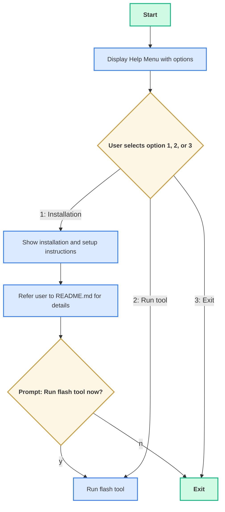
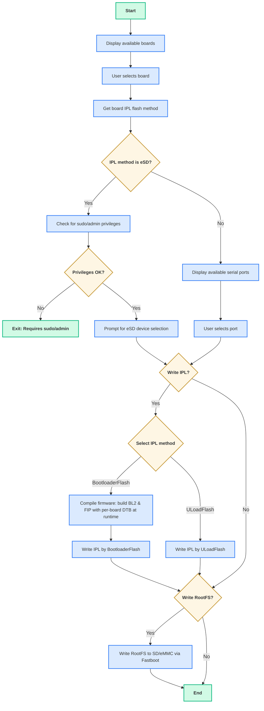

# universal-scripts

The **universal flash script** supports flashing RZ images across multiple boards by using information from a JSON configuration file.

This script offers cross-platform support (for both Windows and Linux operating systems) and handles three key flashing operations for embedded devices:

- Flashing the bootloader
- Flashing the uload-bootloader (only supports xSPI flashing)
- Flashing the Root Filesystem (rootfs) to an SD card / eMMC

Supported boards:

- [RZG2L-SBC](https://www.renesas.com/en/design-resources/boards-kits/rz-g2l-sbc?srsltid=AfmBOopW7k6H7kvdtnxYYs72c6Pm_8u667-UDBi8v9-WXPHjQvzWlhLN)
- [RZG2L-EVK](https://www.renesas.com/en/design-resources/boards-kits/rz-g2l-evkit?srsltid=AfmBOoqqLvuA9ZrzAhhRLi9JR1JVUcoc9MUICwtZ78ZER-hchmQ3ps5I)
- [RS-G2L100](https://www.renesas.com/en/products/microcontrollers-microprocessors/rz-mpus/rz-partner-solutions/geniatech-g2l100)
- [RZV2L-EVK](https://www.renesas.com/en/design-resources/boards-kits/rz-v2l-evkit?srsltid=AfmBOooz3AGWNCJNed1qk6NS0qeZBngU79XQ4h2KUkmMam82y615JPjr)
- [RZV2H-EVK](https://www.renesas.com/en/design-resources/boards-kits/rz-v2h-evk?srsltid=AfmBOooL-eoj5j3zum-HIL5v0JE9SROaKosWHYCOHfvySpJ4g39N9R_V)
- [RZV2H-RDK](https://www.renesas.com/en/design-resources/boards-kits/ws125-v2hrdkrefz)
- [IMDT V2H-SBC](https://www.renesas.com/en/products/microcontrollers-microprocessors/rz-mpus/rz-partner-solutions/imdt-v2-sbc)
- Sparrow-Hawk (RZ/V4H, R8A779G3) — see [RZ/V4H (Sparrow-Hawk) flashing flow](#rzv4h-sparrow-hawk-flashing-flow) for how it differs from the boards above

## Prerequisites:

Before running the scripts, ensure the following dependencies are installed.

### Python

- **Windows**: Download and install Python from the [official website](https://www.python.org/downloads/). Make sure Python is installed with the "Add Python to environment variables" and "Install pip" options enabled.

- **Linux**:  
  ```sh
  sudo apt install python3
  ```

#### Required Python packages

The flashing script depends on the following Python packages. Install them if missing:

- **pyserial**
- **dataclasses** (only if using Python < 3.7)

1. On Linux:

If Python 3.12 is in use: set up a virtual environment first.

```shell
renesas@builder-pc:~/rz-cmn-srp-3.0/host/tools#  sudo apt update
renesas@builder-pc:~/rz-cmn-srp-3.0/host/tools#  sudo apt install python3.12-venv
renesas@builder-pc:~/rz-cmn-srp-3.0/host/tools#  python3 -m venv .venv
renesas@builder-pc:~/rz-cmn-srp-3.0/host/tools#  source .venv/bin/activate
```

After the virtual environment is active, choose one of the two install methods:

- Option 1 - Use `requirements.txt` (recommended)
  ```sh
  cd <path/to/your/package/host/tools>
  pip3 install -r requirements.txt
  ```

- Option 2 - Install manually

```sh
# Ensure pip is available
sudo apt install python3-pip

# Install required packages
pip3 install pyserial
pip3 install dataclasses
```

2. On windows, there are two ways to install:

- If `pip` is missing, repair your Python installation or download [get-pip.py](https://bootstrap.pypa.io/get-pip.py) and run:
    ```powershell
    py get-pip.py
    ```
- Install required packages:
  1. Option 1 - Use `requirements.txt` (recommended)
    ```powershell
    cd <path/to/your/package/host/tools>
    py -m pip install -r requirements.txt
    ```
  2. Option 2 - Install manually
  - Using the Python launcher:

  ```powershell
  py -m pip install pyserial
  py -m pip install tomli
  py -m pip install dataclasses       # Only if Python < 3.7
  ```
 - Or using `pip` directly (if already in PATH):

 ```powershell
  pip install pyserial
  pip install tomli
  pip install dataclasses   # only if Python < 3.7
 ```

### Environment and Tool Dependencies

Make sure you have the following installed or available in `tools/bin/<os>` or `host/tools/bin/<os>`:
- `bpgen` - unified boot parameter generator (already included in the release package)
- `fiptool` - TF-A utility (already included in the release package)
- `objcopy` - part of GNU binutils (see installation steps above)
- `dd` - used to write bootloader binaries directly to the raw SD card device during eSD flashing

Firmware binaries and DTBs must be available in the following location (already included in the release package):

```
target/images/
```

#### Linux

Install the required toolchain and fastboot:

```sh
sudo apt-get update
sudo apt-get install build-essential android-tools-fastboot -y
```

#### Windows

**USB OTG Flashing on Windows**

Fastboot/OTG flashing on Windows requires the device's **Fastboot / USB-download** interface to use the **WinUSB** driver.

> **Note:** Windows binds drivers to the **device/interface present at install time** (VID/PID[/MI]). This Fastboot interface exists **only while** the board is connected over OTG **and** go to OTG download mode.

**Steps to verify USB OTG dependencies are installed correctly:**

1. **Prepare connections**
   - Connect the board's USB-to-serial to the PC and open a terminal (115200 8-N-1).
   - Open **Tera Term** (or any serial console) on the correct COM port/baud.

2. **Enter U-Boot and switch to USB OTG Fastboot**
   - **Power on** the board and **interrupt autoboot** to get a `U-Boot>` prompt.
   - Connect the board's **USB OTG** port to the PC.
   - At the U-Boot prompt, run:
     ```bash
     setenv serial# 'Renesas1'
     fastboot usb 27
     ```
     > This places the board into **USB OTG fastboot/download** mode.\
     > `27` is the index used on RZ Common System

3. **Bind WinUSB using Zadig**
   - Download the latest **[Zadig](https://zadig.akeo.ie/)** and run it (no installation needed).
   - In Zadig, go to **Options → List All Devices**.
   - From the dropdown, select the device that represents the bootloader/fastboot interface.
     - **USB Download Gadget**
   - On the right, set **Driver** to **WinUSB**.
   - Click **Install Driver** (or **Replace Driver**).

4. **Verify**
   - Open **PowerShell** or **Command Prompt** and run:
     ```powershell
     .\path\to\package\sd_creator\tools\fastboot.exe devices
     ```

     Expected:
     ```
      Renesas1         fastboot
     ```

> [!NOTE]  
> **All dependencies bundled for Windows - No Installation Required**  
> All required tools and runtime libraries are pre-bundled in `tools/bin/windows/`:
> - `fiptool.exe` + `libcrypto-3-x64.dll` (OpenSSL library)
> - `bpgen.exe` (statically linked, no DLLs needed)
> - `objcopy.exe` + `libwinpthread-1.dll` (MinGW runtime)
>
> **You do NOT need to install MinGW-w64, MSYS2, or OpenSSL.** The scripts automatically use the bundled binaries.

## JSON Configuration for a New Board

The `flash_images.json` file contains predefined image mappings for supported devices.

`flash_images.json` supports several default boards. You can add a custom board to the configuration file by providing the following information:

- **SoC**: Soc type
- **bl2**: BL2 image name (V2L/V2H/G2L boards)
- **spl** *(V4H only)*: SPL image name — the SA0 header + SPL binary (`sa0.bin`). Used **instead of** `bl2` for boards whose `soc` is `v4h`; see [RZ/V4H (Sparrow-Hawk) flashing flow](#rzv4h-sparrow-hawk-flashing-flow).
- **pcie_fw** *(V4H only, optional)*: PCIe PHY firmware image name (`rcar_gen4_pcie.bin`). If set, it is flashed as an extra image after SPL/FIP.
- **board_identification**: Board identification image name
- **fip**: FIP image name. For `soc: v4h` boards this is a FIT image (`u-boot.itb`) rather than the TF-A FIP package used by other boards.
- **tee** *(optional)*: OP-TEE BL32 binary name.
  - For legacy boards: if present and the binary exists, it is included in the FIP via `fiptool --tos-fw`.
  - For `v4h` boards: unrelated to that FIP path (`firmware_compile.py`'s V4H build never reads it — OP-TEE cannot be embedded into Sparrow-Hawk's `u-boot.itb` this way). Instead, if the named binary exists under `target/images/atf/` (same location legacy boards use), `bootloader_flash.py` writes it as a raw blob to a dedicated SPI-NOR offset (`TEE` in `boards_flash_config.toml`) as an extra step after PCIe firmware/SPL/FIP; skipped entirely if the file is missing. **This only stages the binary on-device — it does not by itself enable OP-TEE on Sparrow-Hawk**, since nothing in the current boot path loads it from that offset — see [Where OP-TEE lives for Sparrow-Hawk](#where-op-tee-lives-for-sparrow-hawk).
- **atf_fdts**: FCONF device tree name
- **uboot_dtb**: U-boot device tree name
- **flash_writer**: Flash Writer image name
- **ipl_flash_method**: Method used by the IPL bootloader for flashing (`xspi` or `emmc`)
- **rootfs**: Root filesystem image name (`*.wic`)
- **rootfs_flash_method**: Method to flash the SD card (`udp` or `otg`)

This table below lists the available options (and sensible defaults) for `ipl_flash_method` and `rootfs_flash_method` per board.

| Board           | SoC/MPU | ipl_flash_method      | Default | rootfs_flash_method | Default |
|-----------------|---------|-----------------------|---------|---------------------|---------|
| rzg2l-sbc       | g2l     | xspi                  | xspi    | udp                 | udp     |
| rs-g2l100       | g2l     | xspi                  | xspi    | udp, otg            | otg     |
| rzg2l-evk       | g2l     | xspi, emmc, esd       | xspi    | udp, otg            | otg     |
| rzv2l-evk       | v2l     | xspi, emmc, esd       | xspi    | udp, otg            | otg     |
| rzv2h-evk       | v2h     | xspi, esd             | xspi    | udp, otg            | otg     |
| rzv2h-rdk       | v2h     | xspi, esd             | xspi    | udp                 | udp     |
| imdt-v2h-sbc    | v2h     | xspi                  | xspi    | udp, otg            | otg     |
| sparrow-hawk    | v4h     | xspi                  | xspi    | udp                 | udp     |

**Notes:**
- *IPL flash method*: `emmc` for `rzv2h` devices is **not supported yet**.
- *RZ/G2L-SBC*: `otg` flashing is not supported. This board supports UDP flashing only.
- *Sparrow-Hawk (RZ/V4H)* uses a different set of images and a different serial protocol than the boards above — see [RZ/V4H (Sparrow-Hawk) flashing flow](#rzv4h-sparrow-hawk-flashing-flow). Only `xspi` has been validated on real hardware (flash + boot to Linux confirmed). `boards_flash_config.toml` also has `[sparrow-hawk.emmc]`/`[sparrow-hawk.esd]` tables and the code paths are generically wired for V4H (via the `SPL` key), but **`emmc` is not currently usable**: `__handle_emmc_flash()` unconditionally sends the `SUP` command to switch to 921600 baud, which Sparrow-Hawk's Flash Writer does not support (it boots at 921600 already and replies `command not found`), so this path will hang/fail. `esd` is implemented but has not been validated on hardware for this board.
- *Sparrow-Hawk (RZ/V4H)*: `otg` rootfs flashing is not supported on this board. This board supports UDP flashing only, over Ethernet port 0.

---

## Field Reference

- **`tee`** *(optional)*
  OP-TEE BL32 binary filename. Meaning depends on the board's `soc`:
  - **Legacy boards** (`g2l`/`v2l`/`v2h`): if set and the binary exists under `target/images/atf/`, `firmware_compile.py`'s `run_all()` passes it to `fiptool` as `--tos-fw` when building the FIP. If the binary is missing, a warning is printed and the field is ignored. `run_all_v4h()` never reads `tee` for these purposes — see [`step_sa0_and_srec()`/`step_fit_and_srec()`](firmware_compile/Readme.md#rzv4h-sparrow-hawk-build-pipeline).
  - **`v4h` boards** (Sparrow-Hawk): unrelated to the FIP-building path above. If the named binary exists under `target/images/atf/`, `universal_flash.py` passes it to `bootloader_flash.py` via `--image_tee`, which writes it as a raw blob to a dedicated SPI-NOR offset (`TEE` in `boards_flash_config.toml`); skipped entirely (no flag passed) if the file is missing. Embedding OP-TEE into `u-boot.itb` directly does not work architecturally for this board, and this raw SPI-NOR write **does not by itself enable OP-TEE** either — see [Where OP-TEE lives for Sparrow-Hawk](#where-op-tee-lives-for-sparrow-hawk).
- **`ipl_flash_method`**
  Defines where the **IPL/BL2** image is flashed:
  - `xspi` — xSPI flash for RZ/V2H, QSPI for RZV2L/RZG2L
  - `emmc` — eMMC device
  - `esd` — eSD card
- **`rootfs_flash_method`**
  How the **root filesystem (.wic)** is delivered to the SD/eMMC target:
  - `udp` — U-Boot `fastboot udp` over Ethernet
  - `otg` — U-Boot `fastboot usb` (USB-OTG)

Example of a sample board configuration in JSON:

```json
"rzg2l-sbc": {
    "soc": "g2l",
    "bl2": "bl2_bp_rzg2l-sbc.srec",
    "board_identification": "rzg2l-sbc-platform-settings.bin",
    "fip": "fip_rzg2l-sbc.srec",
    "tee": "tee-rz-cmn-g2l.bin",
    "atf_fdts": "rzg2l-sbc.dtb",
    "uboot_dtb": "rzg2l-sbc.dtb",
    "flash_writer": "Flash_Writer_SCIF_rzg2l-sbc.mot",
    "ipl_flash_method": "xspi",
    "rootfs": "core-image-minimal.wic",
    "rootfs_flash_method": "udp"
}
```

Example of a `v4h` board configuration (Sparrow-Hawk), using `spl`/`pcie_fw` instead of `bl2`:

```json
"sparrow-hawk": {
    "soc": "v4h",
    "spl": "spl_bp_sparrow-hawk.bin",
    "fip": "fip_sparrow-hawk.bin",
    "pcie_fw": "rcar_gen4_pcie.bin",
    "board_identification": "sparrow-hawk-platform-settings.bin",
    "tee": "tee-rz-cmn-v4h.bin",
    "atf_fdts": "r8a779g3-sparrow-hawk.dtb",
    "uboot_dtb": "r8a779g3-sparrow-hawk.dtb",
    "flash_writer": "Flash_writer_sparrow_hawk_CR52.mot",
    "ipl_flash_method": "xspi",
    "rootfs": "core-image-minimal.wic",
    "rootfs_flash_method": "udp"
}
```

**Note**: When adding a new board entry or adding filename fields for a board, the values for the "bl2" and "fip" fields must include the board identifier (the JSON object key) as a substring.

```
"rzg2l-sbc": {
  "bl2": "bl2_bp_rzg2l-sbc.srec",
  "fip": "fip_rzg2l-sbc.srec",
  ...
}
```

## Flowchart

The universal flash script prompts the user for options and proceeds through the flashing process based on the input. The detailed procedure is as follows:
### Help Menu Flowchart

The following flowchart illustrates the logic when running the help command for the universal flash tool. It shows the user interaction steps and options available:



To display this help menu, use the following command:

- **On Linux:**
  ```bash
  python3 universal_flash.py --help
  ```

- **On Windows:**
  ```powershell
  py universal_flash.py --help
  ```

### Installation Flowchart
This flowchart shows the process when running the universal flash tool directly (without the --help argument). The script will immediately start the flashing workflow:



**Explanation:**
When you run the script without any arguments, it will skip the help menu and immediately prompt you to select a board and begin the flashing process. You will be guided through board selection, serial port setup, IPL and rootfs flashing steps.

Refer to the [Basic Usage](#basic-usage) section for commands to run the tool.

**Notes:**
- Ensure the board is powered off before flashing.
- Insert the SD card if rootfs flashing is selected.
- For Bootloader-flash: set boot switches to SCIF download mode.
- For Uload-flash or rootfs flashing: set boot switches to normal mode.
- **Reset and power-cycle behavior by board:**
  - **RZ/G2L-SBC**
    This board does not provide a dedicated **RESET** button. To restart the board or apply a boot mode change, you must power-cycle it.
  - **RZ/G2L-EVK** and **RZ/V2L-EVK**
    These boards provide a **RESET** button. You can reset the board without removing power, and the USB connection and serial port typically remain available.
  - **RS-G2L100**
    This board does not provide a dedicated **RESET** button. To restart the board or apply a boot mode change, you must power-cycle it.
  - **RZ/V2H-EVK**
    This board provides a **RESET** button. You can reset the board without removing power, and the USB connection and serial port typically remain available.
  - **RZ/V2H-RDK**
    This board does not provide a dedicated **RESET** button. To restart the board or apply a boot mode change, you must power-cycle it by unplugging and reconnecting the power adapter. Because the USB serial interface is powered from the same source, the USB device disconnects during power-cycle and the serial port disappears from the host PC. When power-cycling the board, keep the USB cable connected to the same USB port on the host PC to avoid enumeration or reconnection issues.
  - **IMDT V2H-SBC**
    This board provides a **RESET** button. You can reset the board without removing power, and the USB connection and serial port typically remain available.
  - **Sparrow-Hawk (RZ/V4H)**
    This board provides a **RESET** button. You can reset the board without removing power, and the USB connection and serial port typically remain available. Its Flash Writer talks at 921600 baud from power-on (no `SUP` speed-up step).
- Rootfs flash (UDP Fastboot): U-Boot fastboot-udp uses a single active Ethernet MAC per board. If multiple RJ45/PHY ports exist, only one is active (depending on board support). The script automatically selects the appropriate Ethernet port based on board configuration in `boards_flash_config.toml`. For boards with multiple available ports, the script will prompt you to select which port to use.

  | Board         | Ethernet port(s) used |
  |-------------|----------------------|
  | rzg2l-sbc    | 1                    |
  | rs-g2l100    | 0, 1                 |
  | rzv2l-evk    | 0                    |
  | rzg2l-evk    | 0                    |
  | rzv2h-evk    | 0, 1                 |
  | rzv2h-rdk    | 0                    |
  | imdt-v2h-sbc | 0, 1                 |
  | sparrow-hawk | 0                |

Both fastboot-otg and fastboot-udp write to U-Boot's current MMC device (typically mmc0). Depending on board and revision, mmc0 may point to the SD card or eMMC.

| Board/Rev                                   | Fastboot Method | Typical mmc0 target                                 | How to change target           |
|---------------------------------------------|-----------------|-----------------------------------------------------|-------------------------------|
| RZ/G2L-SBC                                  | UDP             | Carrier SD (board default)                          | N/A (single device)           |
| RS-G2L100                                   | UDP, OTG        | eMMC                                                | N/A (single device)           |
| RZ/V2L-EVK                                  | UDP, OTG        | SD (CN3 on SOM or eMMC device depending on SW1)     | Set SW1-2 ON to SD and OFF to eMMC |
| RZ/G2L-EVK                                  | UDP, OTG        | SD (CN3 on SOM or eMMC device depending on SW1)     | Set SW1-2 ON to SD and OFF to eMMC |
| RZ/V2H-EVK (Rev 1 – 2 SD cards)             | UDP, OTG        | SD card slot 0                                      | N/A (single device)           |
| RZ/V2H-EVK (Rev 2 – SD & eMMC)              | UDP, OTG        | eMMC                                                | N/A (single device)           |
| RZ/V2H-RDK                                  | UDP             | SD card                                             | N/A (single device)           |
| IMDT V2H-SBC                                | UDP, OTG        | eMMC                                                | N/A (single device)           |
| Sparrow-Hawk (RZ/V4H)                       | UDP             | SD card                                             | N/A (single device)           |

---

## RZ/V4H (Sparrow-Hawk) Flashing Flow

Sparrow-Hawk (RZ/V4H, R8A779G3) shares the same `universal_flash.py` entry point and board-selection flow as the boards above, but its **IPL image set and serial protocol are different**. The differences are isolated to the `BootloaderFlash` path — RootFS flashing (Fastboot UDP, over Ethernet port 0) and ULoadFlash are not affected.

Key differences from the legacy RZV2L/RZV2H/RZG2L flow:

1. **Different image set** — no BL2/FIP pair. Instead: **SPL** (SA0 header + SPL binary, `sa0.bin`), **FIP** as a **FIT image** (`u-boot.itb`), and an optional **PCIe PHY firmware** blob (`rcar_gen4_pcie.bin`) that no other board flashes.
2. **Pre-built, not compiled at flash time** — for other boards, `firmware_compile.py` runs `bpgen`/`fiptool` at flash time to assemble BL2/FIP. For `soc: v4h` boards this step is skipped entirely (`prepare_binaries()` returns early): the SA0+SPL and FIT artifacts are produced by the standalone U-Boot (`binman` `renesas-rcar4-sa0` + FIT) build and are expected to already be present under `target/images/` (named per the `spl`/`fip` fields in `flash_images.json`).
3. **Different serial protocol** — `XLS3` (raw binary, chunked in 128KB blocks) instead of `XLS2` (SREC, single upload). This board's Flash Writer has an unreliable SREC→SPI address mapping for large images, so binary chunked mode is used instead, matching the vendor reference flashing tool's behavior.
4. **Different Flash Writer behavior** — boots directly at 921600 baud (the `SUP` speed-up command is not supported — it returns `command not found`) and has no `XCS` full-chip erase step (same as `rzv2h-evk`/`rzv2h-rdk`).

> [!NOTE]
> Only the **`xspi`** flash method has been validated on real Sparrow-Hawk hardware (flash + boot to Linux confirmed). `[sparrow-hawk.emmc]`/`[sparrow-hawk.esd]` exist in `boards_flash_config.toml` and the bootloader-flash code paths are generically wired for V4H, but **`emmc` is currently broken** for this board: `__handle_emmc_flash()` unconditionally sends `SUP` to switch to 921600 baud, which Sparrow-Hawk's Flash Writer does not support. `esd` is implemented but not yet validated on hardware.

> [!NOTE]
> **If Linux hangs at `Waiting for root device /dev/mmcblk1p2...`** after a successful boot to `Starting kernel ...`: the default env's `mmc_args` assumes the rootfs SD card enumerates as `mmcblk1`, but on some hardware it enumerates as `mmcblk0` instead. Fix from the U-Boot prompt: `setenv mmc_args 'setenv bootargs rw rootwait earlycon root=/dev/mmcblk0p2'; saveenv; reset`. This is unrelated to OP-TEE/fitImage — it affects the plain SD-card boot path too.

```mermaid
flowchart TD
  classDef default fill:#f0f4f8,stroke:#333,stroke-width:1px,font-size:14px
  classDef decision fill:#fef6e4,stroke:#c89b3c,stroke-width:2px,font-weight:bold
  classDef action fill:#dbeafe,stroke:#3b82f6,stroke-width:2px
  classDef v4h fill:#fde2e2,stroke:#dc2626,stroke-width:2px
  classDef terminal fill:#d1fae5,stroke:#10b981,stroke-width:2px,font-weight:bold

  A[Start: universal_flash.py]:::terminal --> B[Select board: sparrow-hawk]:::action
  B --> C[Select serial port]:::action
  C --> D["Baud rate forced to 921600\n(default for other boards is 115200)"]:::v4h
  D --> E{"Write IPL?"}:::decision
  E -->|No| Z1[Skip to RootFS step]:::action
  E -->|Yes| F{"IPL method"}:::decision
  F -->|BootloaderFlash| G["soc == v4h:\nskip bpgen/fiptool build,\nartifacts already in target/images/"]:::v4h
  F -->|ULoadFlash| F2[Not implemented for V4H]:::action

  G --> H[Write IPL by BootloaderFlash]:::action
  H --> I["Board power-cycled into SCIF download mode\nwait for 'Load Program to RT-SRAM'"]:::v4h
  I --> J[Upload Flash Writer image]:::action
  J --> K["Flash Writer ready at 921600\n(SUP command skipped - unsupported)"]:::v4h
  K --> L["XCS full-chip erase SKIPPED\n(same as rzv2h-evk/rzv2h-rdk)"]:::v4h

  L --> M["XLS3 chunked write: SPL (SA0+SPL)\n128KB chunks"]:::v4h
  M --> N["XLS3 chunked write: FIP (FIT image)"]:::v4h
  N --> O{"pcie_fw configured?"}:::decision
  O -->|Yes| P[XLS3 chunked write: PCIe PHY firmware]:::v4h
  O -->|No| O2
  P --> O2{"tee binary found\nunder target/images/atf/?"}:::decision
  O2 -->|Yes| P2["XLS3 chunked write: tee\n(staged only - not loaded by\ncurrent boot path, see OP-TEE section)"]:::v4h
  O2 -->|No| Q
  P2 --> Q[XLS3 write: Board Identification]:::action
  Q --> R[Close serial port]:::action
  R --> S{"Write RootFS?"}:::decision
  Z1 --> S

  S -->|Yes| T["Fastboot UDP over Ethernet port 0\n(single port configured - no prompt)\nwrite RootFS to SD card"]:::v4h
  T --> U[Power-cycle to normal boot mode]:::action
  S -->|No| U
  U --> V[Board autoboots to Linux]:::terminal
```



### Comparison with the legacy RZ flow

| Step | Legacy flow (RZV2L/RZV2H/RZG2L) | Sparrow-Hawk (RZ/V4H) flow |
|---|---|---|
| Firmware build | `bpgen` (BL2+BP) + `fiptool` (FIP) run at flash time | Skipped — SA0+SPL and FIT are pre-built elsewhere and copied into `target/images/` |
| Images written | BL2 (`.srec`), FIP (`.srec`), BID | SPL (`.bin`), FIP=FIT (`.bin`), optional PCIe firmware (`.bin`), optional tee (`.bin`, staged only), BID |
| `flash_images.json` key | `bl2` | `spl` (+ optional `pcie_fw`, `tee`) |
| `boards_flash_config.toml` key | `[<board>.xspi] BL2 = [...]` | `[sparrow-hawk.xspi] SPL = [...]` |
| Serial protocol | `XLS2` (SREC, one-shot upload) | `XLS3` (raw binary, 128KB chunked) |
| Baud rate | 115200 → `SUP` command switches to 921600 | 921600 from power-on; `SUP` skipped |
| QSPI erase | `XCS` full-chip erase (~60s) before writing | Skipped (same as `rzv2h-evk`/`rzv2h-rdk`) |
| eMMC/eSD config table | `[<board>.emmc]` / `[<board>.esd]`, `BL2` key | `[sparrow-hawk.emmc]` / `[sparrow-hawk.esd]`, `SPL` key |

For the full field-by-field flash offsets, see `bootloader_flasher/README.md` and `config/README.md`.

### Where OP-TEE lives for Sparrow-Hawk

For the legacy boards, OP-TEE (BL32) is included by `firmware_compile.py` at flash time: if the board's `tee` field in `flash_images.json` points to an existing binary, `step_fip_and_srec()` passes it to `fiptool create --tos-fw <tee.bin>`, bundling BL31+OP-TEE+U-Boot into one FIP that gets written to SPI/eMMC/eSD via `bootloader_flash.py`.

Sparrow-Hawk's `u-boot.itb` (the `fip_sparrow-hawk.bin` this tool flashes to SPI NOR) is not produced by `fiptool` — it is a FIT image built by **binman** as part of the `u-boot-sst` build, and `run_all_v4h()` only copies the already-built `sa0.bin`/`u-boot.itb` into `target/images/`. It contains only U-Boot proper + FDT; embedding BL31/OP-TEE directly into it **was investigated and does not work**:

- An attempt was made to add extra `atf-1`/`tee-1` FIT image nodes to `u-boot-sst`'s `arch/arm/dts/r8a779g0-u-boot.dtsi` binman definition, so that `make BL31=... TEE=...` would embed both blobs into `u-boot.itb` and SPL would load them as FIT `loadables` alongside U-Boot.
- This builds fine and SPL does load all three images successfully (confirmed with debug instrumentation on real hardware), but **the board hangs immediately after `EVTB1 board detected`**, before any U-Boot proper output.
- Root cause: SPL's `spl_fit.c` only copies each loadable's raw bytes to its FIT `load` address — it does **not** invoke the `U_BOOT_FIT_LOADABLE_HANDLER(IH_TYPE_TFA_BL31, ...)` / `(IH_TYPE_TEE, ...)` handlers in `board/renesas/common/gen4-common.c` that set up the BL2→BL31 handoff structure and jump to OP-TEE. Those handlers are only invoked by `fit_loadable_process()` in `boot/image-board.c`, which is U-Boot **proper's** `bootm` command processing a FIT — not anything SPL does. With `tee-1`'s FIT `load` address (`0x44100000`, taken from `OPTEE_ENTRY` in `board/renesas/common/gen4-common.c`, the address OP-TEE runs at *after* BL31 hands off to it) colliding with U-Boot's own load address, SPL ends up overwriting the just-loaded U-Boot with OP-TEE before jumping to it — hence the hang.
- This change was reverted; `boards_flash_config.toml`'s `[sparrow-hawk.xspi]` `BID`/`PCIE` offsets and `u-boot-sst`'s `CFG_SPL_PLATFORM_SETTINGS_OFFSET` are back to their original values (`0x2C0000`/`0x300000`), matching the known-good boot flow confirmed in earlier updates.

This is exactly why the AMECSSTSWA-400 OP-TEE port for Sparrow-Hawk uses a **separate FIT image (`fitImage`) on the SD card** instead: `fitImage` is processed by U-Boot proper's `bootm`/`booti`, which *does* call `fit_loadable_process()` and correctly invoke the BL31/OP-TEE handoff handlers.

`rz-utils` neither builds nor flashes a `fitImage` for Sparrow-Hawk — OP-TEE-enabled images for this board (kernel + `fitImage` with BL31/OP-TEE as FIT `loadables`) are built and flashed to the SD card outside this tool (e.g. Yocto's `meta-sparrow-hawk` layer). `sd_flash.py` only flashes whatever `.wic` rootfs image it's given via `--image_rootfs`, as-is. The `"tee": "tee-rz-cmn-v4h.bin"` field on the `sparrow-hawk` entry in `flash_images.json` remains unrelated and unused by `firmware_compile.py`'s FIP-building path (`fiptool --tos-fw`, legacy-board-only).

**Where the BL31 for that `fitImage` should come from:** `meta-sparrow-hawk/recipes-bsp/arm-trusted-firmware/arm-trusted-firmware_git.bb` builds `bl31-sparrowhawk.bin` from a *separate* checkout of **upstream `ARM-software/arm-trusted-firmware.git`** (branch `master`, pinned at `1d5aa939bc8d3d892e2ed9945fa50e36a1a924cc`, TF-A v2.14) — not from `rz-atf`/`styhead/rz-cmn` (TF-A v2.9, used for the legacy boards' BL2/BL31). It's built standalone (`PLAT=rcar_gen4 LSI=V4H SPD=opteed`), deployed but not packaged by that recipe, and does not appear in `meta-sparrow-hawk/recipes-dev/ipl-burning/ipl-burning.bb`'s SPI-NOR image bundle at all — confirming it isn't meant to be flashed to SPI-NOR directly. It's meant to be a `loadables` entry (`tfa-1`) inside the SD-card `fitImage`: `board/renesas/common/gen4-common.c` shows Sparrow-Hawk's U-Boot proper runs at EL3 and, when `bootm`/`booti` processes a FIT containing it, builds the BL2→BL31 handoff struct itself before jumping into it (see `tfa_bl31_image_process()`/`armv8_switch_to_el2_prep()`, both guarded on `current_el() == 3`). `meta-sparrow-hawk/recipes-bsp/u-boot/u-boot/0006-rcar-gen4-add-optee-bl32-fit-handoff.patch` adds the matching `tee_image_process()` handler for a `tee-1` loadable so BL31 can hand off to OP-TEE — this patch is not yet applied to the `u-boot-sst` tree this project builds from.

**Confirmed on real hardware that placing a raw tee binary on SPI-NOR does not by itself enable OP-TEE:** a raw `tee` binary was written to a spare, otherwise-unreferenced SPI-NOR offset alongside a normal IPL flash. The board booted identically to every prior non-OP-TEE boot — no trace of tee/optee anywhere in SPL, U-Boot, or kernel logs. Nothing in the SA0/SPL → U-Boot-proper path reads a SPI-NOR offset unless a FIT `loadables` entry points at it, so simply placing a binary somewhere in SPI-NOR (the legacy-board approach) does not work for Sparrow-Hawk.

**Optional `tee` staging step (`bootloader_flash.py --image_tee`):** despite the above, `universal_flash.py`/`bootloader_flash.py` support writing a raw tee binary to a dedicated SPI-NOR offset (`TEE` in `boards_flash_config.toml`, currently `0x1000000`) as part of a normal IPL flash — if the `sparrow-hawk` entry's `tee` field names a binary that exists under `target/images/atf/`, it's written automatically after PCIe firmware; the step is skipped entirely (no flag passed) if the file is missing. This is purely a staging step for a future boot flow that knows to read this offset (e.g. a BL2 build aware of Sparrow-Hawk) — it does **not** currently make OP-TEE run, for the reasons established above. To actually get OP-TEE running today, use the `fitImage`/SD-card path instead.

> [!WARNING]
> **This offset was originally `0x400000` and that value corrupted a board's board identification on real hardware.** `CFG_SPL_PLATFORM_SETTINGS_OFFSET` (in `u-boot-sst`'s `include/configs/rz-cmn.h`) used to be `0x400000` before commit "rz-cmn: fix V4H BID boot defaults" moved it to `0x2C0000` (matching `BID` above). An SPL built before that commit still reads board identification from `0x400000` — writing a tee binary there overwrote its `model_id`/`model_string` with tee data, producing a garbled `model_id` and a hang right after `Starting kernel ...` (confirmed on real hardware). If you ever need to change this offset again, check `u-boot-sst`'s full git history for `CFG_SPL_PLATFORM_SETTINGS_OFFSET` (and any other SPI-NOR offset near it) first — not just its current value.

---

## Basic Usage

### On Windows:

```bash
py universal_flash.py
```

**Note**: eSD flashing requires Administrator privileges on Windows. Please open PowerShell or Command Prompt as Administrator by right-clicking it and selecting Run as Administrator.

### On Linux:

```bash
python3 universal_flash.py
```

**Note:** eSD flashing requires elevated privileges to write to the raw SD card device. You may be prompted for your sudo password during the eSD flashing step.

### Dedicated Flashing Scripts

If preferred, individual scripts can be used for each flashing operation.

#### Flash Bootloader

This script is used to flash the initial bootloader image onto the board via a serial interface. It is typically used when setting up the board for the first time or recovering from a corrupted bootloader.

Location:
```
host/tools/bootloader_flasher/
```

Refer to the `Readme.md` file in that folder for detailed instructions.

#### Flash Bootloader from U-Boot Console

This method allows bootloader updates directly from the U-Boot console without requiring changes to hardware boot modes. It is ideal for in-system updates after the system is already running.

Location
```
host/tools/uload_bootloader/
```

Refer to the `Readme.md` file in that folder for detailed instructions.

#### Flash Root Filesystem to microSD Card

This script is used to write the root filesystem and related images to a SD card, which the board uses to boot and run Linux.

Location
```
host/tools/sd_creator/
```

Refer to the `Readme.md` file in that folder for detailed instructions.